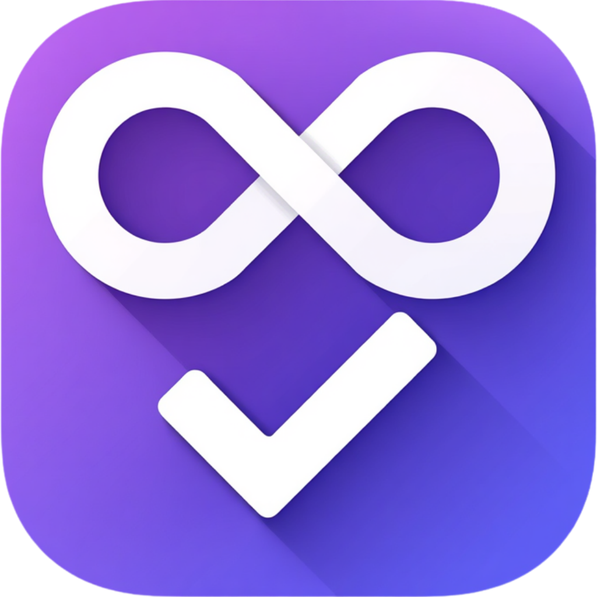

# Infinite Todo



A SwiftUI + SwiftData todo app where tasks can nest inside tasks, to any depth.

## Features

- **Infinite nesting** — any task can have subtasks, which can have their own subtasks, etc. Completing a parent completes its whole subtree; completing the last open child completes the parent.
- **Lists** — named, color- and icon-tagged containers for root-level tasks.
- **Due dates & reminders** — local notifications fire before a task is due, with hourly/daily/weekly/monthly/yearly recurrence.
- **Drag & drop** — reorder tasks and lists, re-parent a task under another, or move a task to a different list.
- **Two home layouts** — a vertical stack of list cards, or a Google Tasks-style horizontal tab bar. Switchable in Settings.
- **Light/Dark/System appearance**, independent of the device setting.

## Requirements

- Xcode 26+
- iOS 26.5+ (see `IPHONEOS_DEPLOYMENT_TARGET` in project settings)
- No external dependencies — pure SwiftUI + SwiftData.

## Building

Open `infinite-todo.xcodeproj` in Xcode and run the `infinite-todo` scheme on a simulator or device.

## Project structure

```
infinite-todo/
  Models/       TodoItem, TaskList, AppTheme, TaskTransferID — SwiftData models and small value types
  Services/     TaskManager, ListManager, NotificationManager — all structural mutations and side effects
  Views/        SwiftUI views
  ContentView.swift       Root screen (stack/tabs layout switch)
  InfiniteTodoApp.swift   App entry point
```

Structural mutations (reordering, re-parenting, moving between lists, cascading completion) are centralized in `TaskManager`/`ListManager` rather than in views, so ordering and cycle-prevention logic lives in one place.
